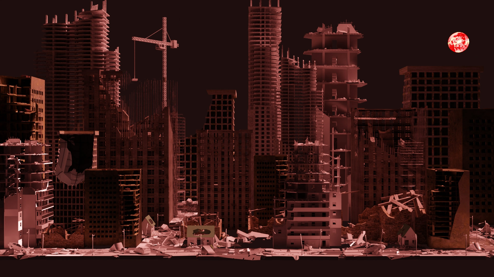
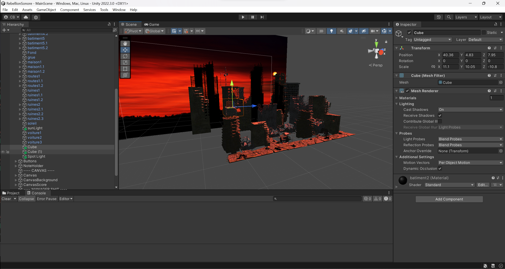
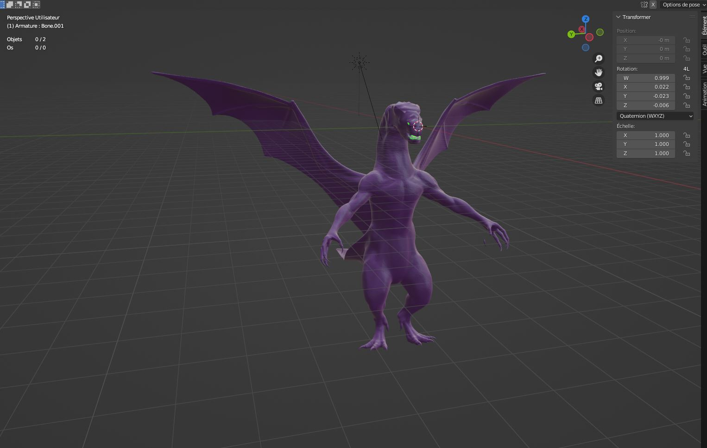
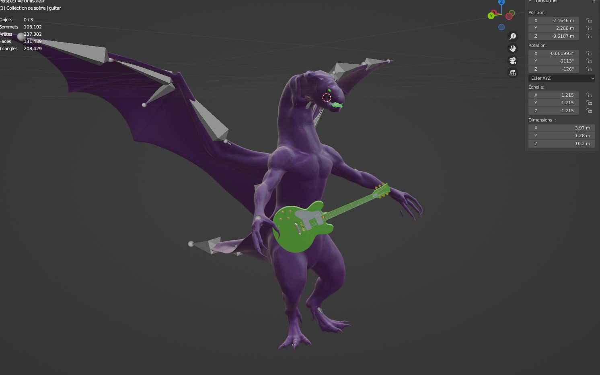
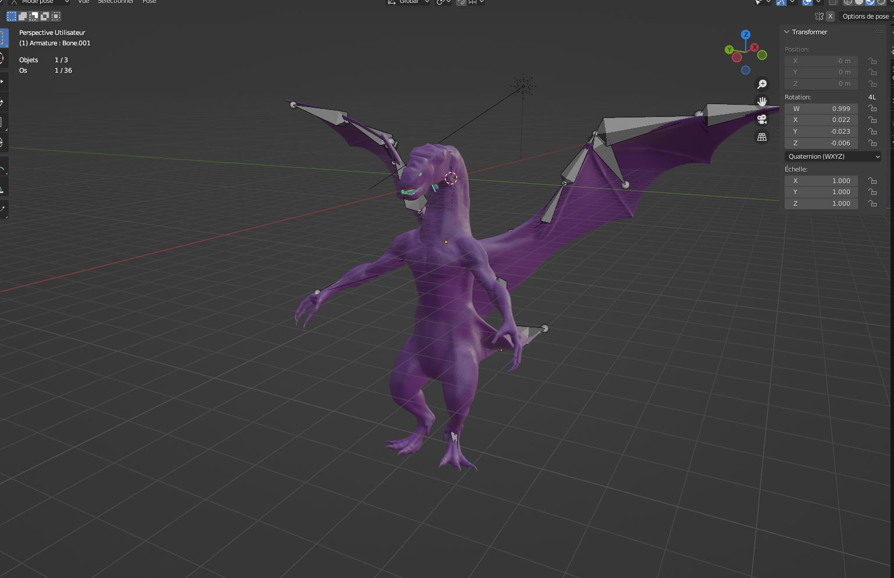

## Résumé

### Évan :

Cette semaine, j'ai enregistré ma voix pour la capsule promotionnelle et terminé le premier décor du jeu. J'ai passé beaucoup de temps à optimiser le décor.

Rendu avec Eevee :

Rendu avec Cycles :

### Mégane :

Cette semaine, j'ai passé beaucoup de temps sur le montage vidéo de la capsule promotionnelle. J'ai aussi retravaillé l'audio de la vidéo pour qu'il soit égalisé et j'ai testé différentes techniques pour enlever les sons en arrière-plan. J'ai aussi appliqué des effets sur l'audio pour enlever le plus de plosives possible. Lorsque la vidéo était terminée, je l'ai publiée sur Facebook.

### Kevin :

Cette semaine, j'ai complété le montage de la musique en faisant en sorte que tous les éléments marchent ensemble. Aussi j'ai aidé l'équipe en accomplissant des tâches diverses comme créer des visuels pour l'éventuelle foule et compter le nombre de tubes de PVC nécessaire au projet.

### Charles :

Pendant cette semaine, j'ai intégré le décor qu'Évan a fait dans Unity, et j'ai intégré la musique que Kevin et Justin ont faite. J'ai aussi beaucoup optimisé le code pour que les collisions marchent mieux avec l'InputSystem d'Unity.

### Xavier :

Cette semaine, j'ai complété le personnage dragon. J'ai fusionné les yeux, les dents et la tête. De plus, j'ai mis une armature sur le personnage pour les futures animations. J'ai importé la guitare.

### Justin :

Kevin et moi avons décidé que la première musique serait en fait une partie de la musique complète (1/3) pour ainsi faire en sorte que les joueurs puissent jouer chacun leur tour assez longtemps. Le joueur 1 jouerait durant la première partie, suivi du joueur 2 et les deux en même temps pour la dernière partie.

## Bons coups et réussites

### Justin :

Ayant réussi avec Kevin la première musique. Nous nous sommes séparés pour créer une musique de notre bord pour aller plus vite. Kevin va partir avec un style maritime alors que moi ce sera un style _Cyberpunk_.

### Évan :

J'ai réussi à mieux optimiser le décor que ce que je pensais. Je pensais finir avec un décor assez lourd, mais en effaçant les bons assets et en replaçant les textures, j'ai pu finir avec décor très léger. Le décor est passé de 3.5 GB à moins de 90 Mb.

### Mégane :

J'ai trouvé une technique facile pour égaliser les sons sur Premiere Pro. J'avais essayé sur Audition et même à l'oreille sur After Effects, mais la technique que j'ai fini par découvrir a vraiment rendu la tâche plus facile.

### Charles :

J'ai optimisé la scène Unity en utilisant des prefabs pour les notes et en changeant les scripts pour que j'aie moins de problèmes plus tard dans la production.

### Xavier :

J'ai appris comment optimiser le nombre de vertices.

### Kevin :

J'ai approfondi mes connaissances avec les filtres audio d'Audition.

## Difficultés et défis

### Évan :

J'ai eu de la difficulté à trouver comment optimiser le décor. Charles a réussi à trouver un des éléments majeurs de la grosse taille du fichier en testant sur Unity.

### Mégane :

J'avais oublié à quel point mon ordinateur était lent lorsque j'utilise des logiciels d'Adobe. Je pense que j'ai perdu beaucoup de temps, parce que mon ordinateur _crash/freeze_ souvent.

### Charles :

Le InputSystem a prouvé être encore un problème, surtout en lien avec les scripts et la documentation qui n'est pas trop claire, mais j'ai réussi à faire marcher les nouveaux scripts quand même.

### Xavier :

Beaucoup trop de vertices !!!! J'avais 5 millions d'arêtes. C'était beaucoup trop lourd pour fusionner le squelette et le personnage. J'ai perdu beaucoup de temps à faire fonctionner mon ordi en regardant le modèle pour rien. Charles m'a montré une technique pour diminuer énormément le nombre de vertices et d'arêtes. Cela a affecté la qualité, mais j'ai pu mettre l'armature sur le personnage. Je suis tombé à 28000 vertices.

### Kevin :

Je trouve que je n'arrive pas à bien faire fonctionner les clips audio qu'on a assemblés pour la première musique. Je pense qu'il faut qu'on retravaille, Justin et moi, la première musique.

## Tâches effectuées

- Finitions et optimisation du premier décor
- Égalisation de l'audio de le vidéo promotionnelle
- Suppression de plus de plosives possible
- Montage de la vidéo promotionnelle
- Publications sur Facebook
- Réalisation de la première musique
- Intégration du décor dans Unity
- Optimisation de la scène et des scripts Unity
- Finalisation brute du personnage
- Personnage avec son armature
- Import de la guitare avec le personnage
- Début des musiques #2 et #3
