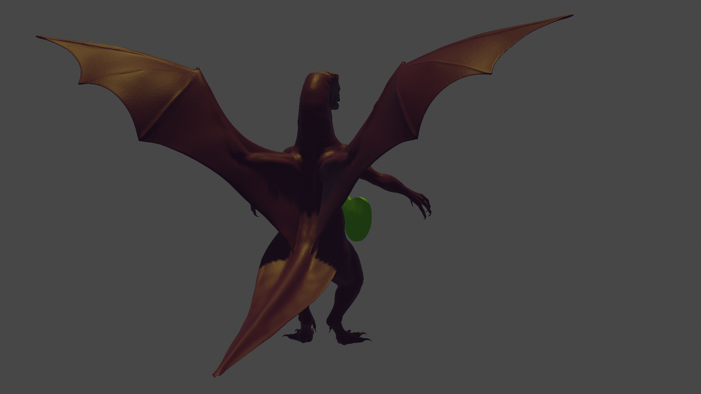
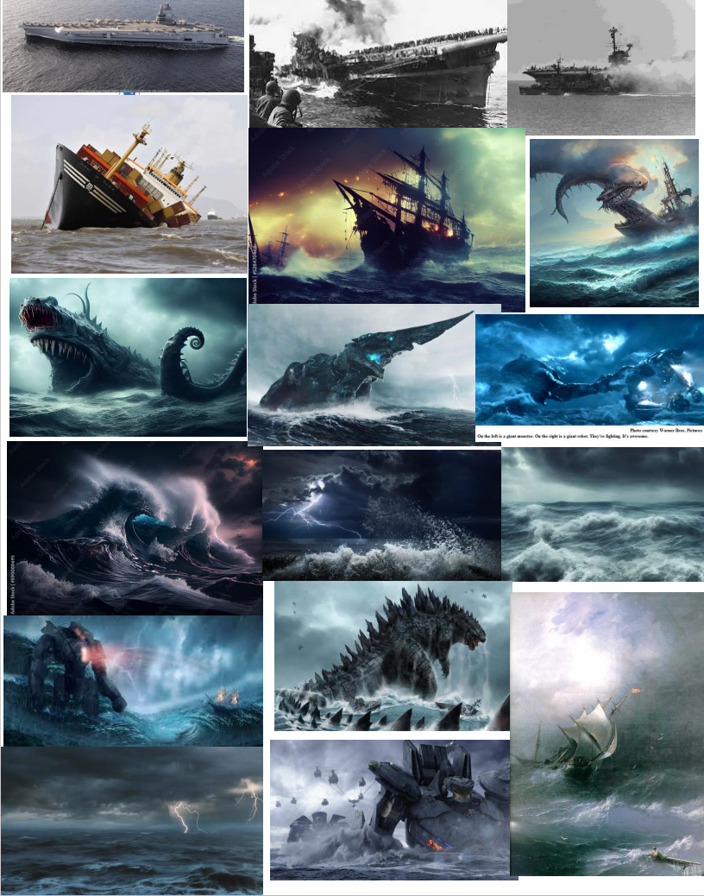
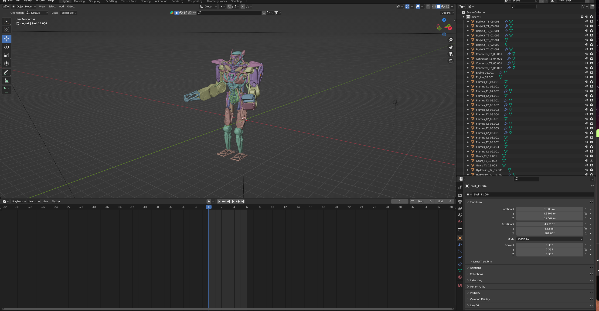
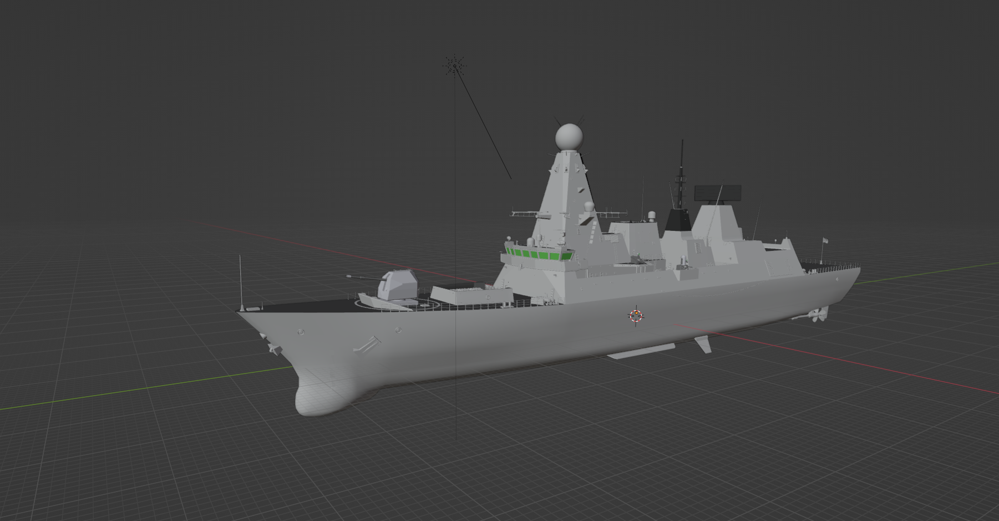
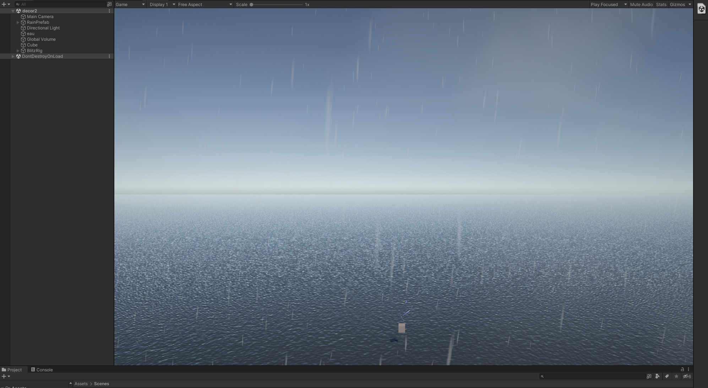
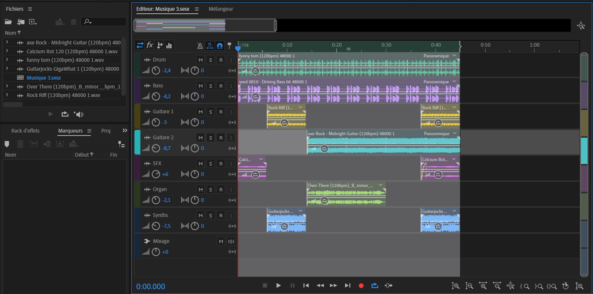

## Résumé

### Mégane :

Cette semaine j'ai fait des recherches d'idées pour l'affiche imprimée, fait des tests sur Blender pour prendre des images du personnage pour l'affiche imprimée, fait des captures de photos et vidéos pendant les cours pour du contenu pour la capsule vidéo, et fait des publications sur Instagram et Facebook.

Test sur Blender:

### Évan :

Cette semaine, je me suis focalisé sur la recherche d'assets pour le deuxième décor du jeu qui aura un thème maritime. Inspiré des films et jeux de pirates ainsi que la série de films _Pacific Rim_, le décor sera composé d'une mer déchaînée par une tempête ainsi que des débris de bateaux et de méchas. J'essaye aussi de modifier les assets pour les faire convenir au projet.

Le moodboard du décor 2 :

Voici des exemples d'assets qui seront utilisés dans le décor :

### Justin :

De mon côté, j'ai bien avancé la musique #3. Il me reste à harmoniser le tout et peut-être ajouter des voix (chorale).

## Bons coups et réussites

## Difficultés et défis

### Évan :

Ma plus grande difficulté cette semaine est de trouver des assets pour Unity qui seront utilisés dans le décor 2. La majorité du décor va bouger, donc j'ai besoin d'assets spécialement conçus pour Unity, mais la grande majorité de ces assets coutent de l'argent, et pas qu'un peu. Les assets gratuits que je trouve sont de basse qualité et doivent être modifiés pour le projet, ce qui prend du temps et qui n'est pas super facile.

## Tâches effectuées

- Recherche d'assets pour le décor 2
- Modifier et optimiser les assets du décor 2
- Développement des musiques #2 et #3
- Recherche d'idée pour l'affiche imprimée
- Capture de contenu pour la capsule vidéo
- Capture et publication de contenu sur Facebook et Instagram
