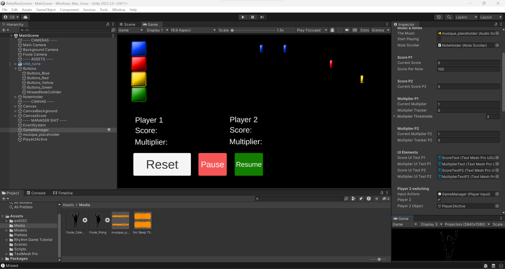

## Résumé

### Mégane :

Cette semaine j'ai fait des recherches d'idées pour l'affiche imprimée, fait des tests sur Blender pour prendre des images du personnage pour l'affiche imprimée, fait des captures de photos et vidéos pendant les cours pour du contenu pour la capsule vidéo, et fait des publications sur Instagram et Facebook.

Test sur Blender:

### Évan :

Cette semaine, je me suis focalisé sur la recherche d'assets pour le deuxième décor du jeu qui aura un thème maritime. Inspiré des films et jeux de pirates ainsi que la série de films _Pacific Rim_, le décor sera composé d'une mer déchaînée par une tempête ainsi que des débris de bateaux et de méchas. J'essaye aussi de modifier les assets pour les faire convenir au projet.

Le moodboard du décor 2 :

Voici des exemples d'assets qui seront utilisés dans le décor :

### Justin :

De mon côté, j'ai bien avancé la musique #3. Il me reste à harmoniser le tout et peut-être ajouter des voix (chorale).

### Xavier:

J'ai avancé les shaders du dragon. J'ai commencé à faire les décorations telles que des anneaux cheveux. Pour la suite je compte intégrer une veste.

### Kevin:

Durant la semaine 11, j'ai composé dans son entièreté la deuxième musique de l'expérience. Je suis aller cherché en premier les samples de guitares et ensuite les percussions. Une fois la guitare et les percussions assemblées, j'ai finalisé la composition avec de la basse que j'ai enregistrer par moi-même. Aussi, j'ai refait une musique pour remplacer la première dont je n'étais pas satisfait. J'ai suivi le même processus que pour la musique 2, à l'exception que j'ai composé les percussions avec le drum rack d'Ableton.

### Charles:

Cette semaine j'ai continué la programmation Unity du jeu et j'ai optimisé le code pour 2 joueurs. Aussi, j'ai rajouté le score pour le score du deuxième joueur, j'ai programmé la manette du joueur 2 et j'ai ajouté l'intégration ou il faut strummer la guitare pour bien avoir la note. De plus, j'ai programmé le switch du joueur 1 au joueur 2 dans la musique et le gameplay et j'ai fait la programmation de la foule pour représenter le score aux joueurs. À travers tout ça, j'ai aussi beaucoup avancé l'intégration des lumières dans TouchDesigner et j'ai joué avec plusieurs lumières DMX pour savoir comment les _daisy-chain_. J'ai aussi optimisé les LED pour que les notes qui apparaissent soient plus claires au joueur.

## Bons coups et réussites

### Charles:

La programmation du deuxième joueur s'est bien passée, pas beaucoup de problèmes dans le développement. La même chose pour les lumières DMX, une fois qu'on sait comment ça marche, c'est assez simple.

## Difficultés et défis

### Évan :

Ma plus grande difficulté cette semaine est de trouver des assets pour Unity qui seront utilisés dans le décor 2. La majorité du décor va bouger, donc j'ai besoin d'assets spécialement conçus pour Unity, mais la grande majorité de ces assets coutent de l'argent, et pas qu'un peu. Les assets gratuits que je trouve sont de basse qualité et doivent être modifiés pour le projet, ce qui prend du temps et qui n'est pas super facile.

### Xavier:

Ma difficulté cette semaine fut avec l'équipement. J'ai eu beaucoup de problèmes avec les ordis de l'école comme chez moi. J'ai aussi de la misère avec internet.

### Charles:

Au début avec les lumières DMX, j'étais un peu confus sur les channels et les adresses, mais je crois que j'ai compris, et depuis ça marche beaucoup mieux.

## Tâches effectuées

- Recherche d'assets pour le décor 2
- Modifier et optimiser les assets du décor 2
- Développement des musiques #2 et #3
- Recherche d'idée pour l'affiche imprimée
- Captures de contenu pour la capsule vidéo
- Captures et publications de contenu sur Facebook et Instagram
- Fin des textures pour le dragon
- Début des accessoires pour le dragon
- Programmation des visuels score/foule sur Unity
- Programmation du joueur 2 (manette, score, gameplay/musique)
- Programmation du strum de la guitare (manettes)
- Optimisation des notes sur les LED
- Commencement de la programmation des effets de lumière sur TouchDesigner
