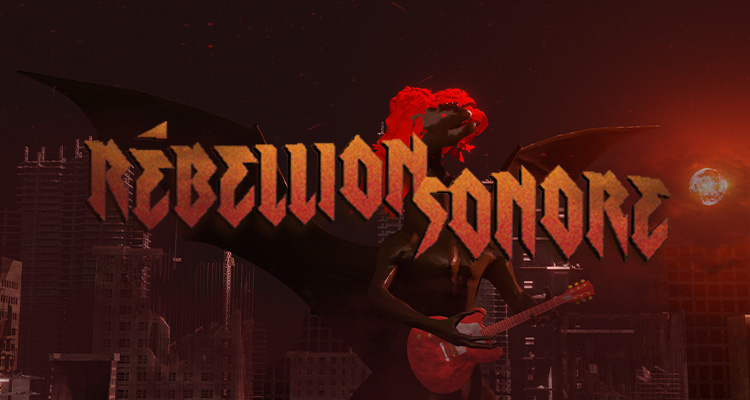
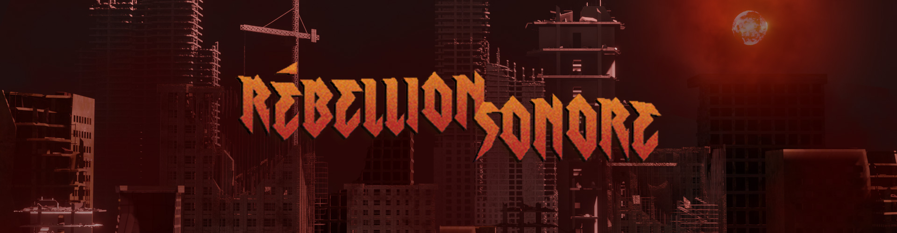
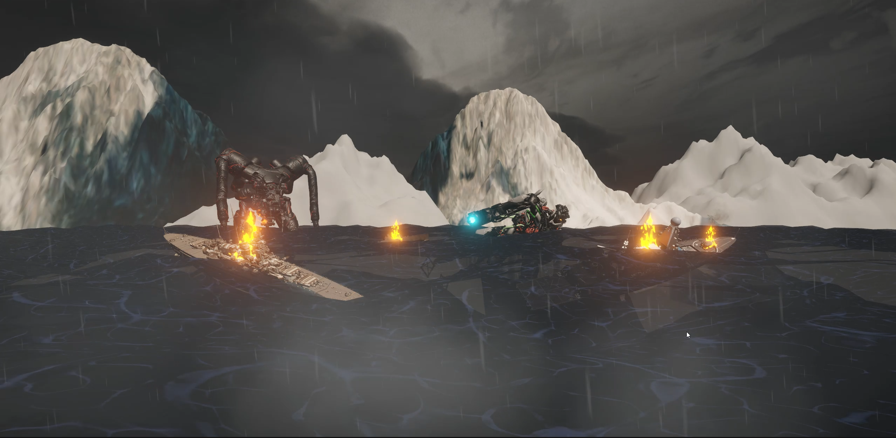
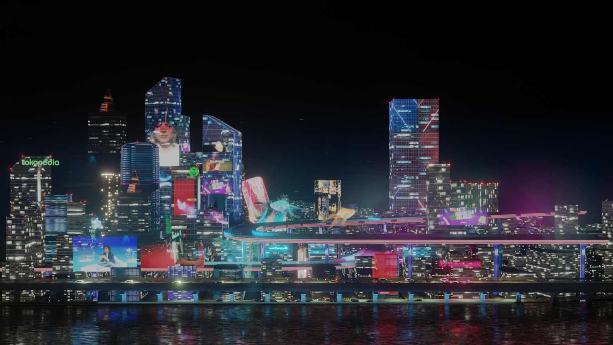

## Résumé

### Mégane :

J'ai fait quelques tests de montage pour l'affiche imprimée pour voir comment je pouvais intégrer le dragon dans le montage. Au début, je voulais utiliser une photo d'une scène pour le fond, mais mes collègues et moi avons réalisé que ça ne mettait pas vraiment le dragon en valeur. Alors, pour mon prochain test, je vais intégrer le dragon dans une scène 3D sur Blender et prendre une photo pour l'affiche.

En attendant l'accord du professeur pour savoir si notre affiche est prête à être imprimée, je me suis occupée des bannières.

Puis, j'ai commencé à planifier la capsule vidéo.

### Évan :

J'ai terminé la recherche des assets pour le décor 2 et le décor 3. J'ai fait le montage des deux derniers décors. Le décor 2 n'est pas fini, car il faut que je règle des problèmes avec certains assets et je dois bouger les objets dans la scène. La caméra aussi est à voir.

Pour le décor 3, j'ai trouvé un asset de ville déjà fait. Cela me facilite la tâche. J'ai profité du temps gagné pour optimiser l'asset de ville et ajuster les éléments du décor.

### Justin :

J'ai fini la musique 3. De son côté, Kevin a fini de faire la voix de l'annonceur (disant le numéro de la manche et c'est le tour de quel joueur à jouer), je l'ai donc ajoutée dans ma musique. Pour aider Évan avec le décor 3, je vais essayer de l'optimiser pour qu'il soit moins lourd à charger.

### Charles :

Cette semaine, j'ai continué le travail sur le projet Unity, j'ai fait et intégré la fin de la première chanson sur Unity. J'ai aussi programmé la foule et son mouvement qui correspondent aux scores des deux joueurs. De plus, j'ai commencé à intégrer la scène 2, et j'ai réparé quelques problèmes de programmation.

### Xavier :

Cette semaine, j'ai arrangé le "Wheight paint" du dragon pour les futures animations. Quand on bougeait les membres du personnage, certains vertices bougeaient aléatoirement. Maintenant, il ne reste que l'animation du personnage. De plus, j'ai trouvé comment importer les animations sur Blender et les faire jouer à un moment voulu.

### Kevin :

Cette semaine, j'ai réalisé l'animation 2D et le bruit de la foule qui vont être affichés devant le joueur. J'ai aussi fait l'animation de l'arrière-plan de la scène 1 du projet. Je suis allé chercher plusieurs éléments à animer au rythme de la musique.

## Bons coups et réussites

### Mégane :

J'ai appris plusieurs techniques sur Photoshop pour rendre un montage plus réaliste en prenant en compte les teintes, saturations, contrastes et la luminosité de tous les objets présents dans le montage afin de pouvoir les harmoniser ensemble. Avant, j'y allais beaucoup plus à l'oeil.

### Évan :

J'ai réussi à trouver un asset de ville dans un thème _Cyberpunk_ déjà tout construit. En plus, la ville est déjà animée et texturée. Cela m'a fait gagner énormément de temps.

### Justin :

J'ai réussi à optimiser le décor 3 en supprimant les éléments qu'on ne voyait pas à la caméra et régler les problèmes de matériaux (Blender ne crash plus quand on sauvegarde en mode rendu). Ainsi, Évan a pu faire un rendu pour pouvoir le mettre dans Unity (on va mettre une vidéo plutôt qu'importer la scène, ça sera moins lourd puisque la scène est déjà animée).

## Difficultés et défis

### Mégane :

Souhaitant intégrer le dragon dans l'affiche, j'ai voulu prendre des photos de celui-ci dans Blender. Cependant, il y a eu quelques bugs avec l'armature qui ont rendu la tâche plus difficile. Grâce à l'aide de Charles et de Justin, j'ai réussi à régler le problème.

### Évan :

J'ai beaucoup de difficulté avec les textures du décor 2. La grande majorité des assets sont texturés à l'aide de Blender et Unity ne prend pas en charge certaines textures de Blender. Je dois trouver un moyen d'exporter les assets avec leurs textures vers Unity.

### Kevin :

J'ai eu de la difficulté à intégrer la scène de Blender à Unity. J'ai dû prendre un moment pour me rappeler de l'interface Unity. J'ai appris qu'on ne pouvait pas intégrer de vidéo avec de la transparence dans Unity.

## Tâches effectuées

- Tests d'intégration du dragon dans l'affiche imprimée
- Arrangement des assets des décors 2 et 3
- Montage du décor 2 sur Unity
- Finitions des bannières 1 et 2
- Finitions de l'affiche imprimée (en attente de réponse du professeur)
- Planification de la capsule vidéo
- Intégration de la foule dans Unity
- Intégration du décor 2 dans Unity
- Ajouté transitions de fin et animation de fin
- Ajouté d'autres effets de lumières avec TouchDesigner
- Correction des vertices du dragon et redécouverte comment animer dans Unity
- Animation et son de la foule
- Animation de l'arrière-plan de la scène 1
