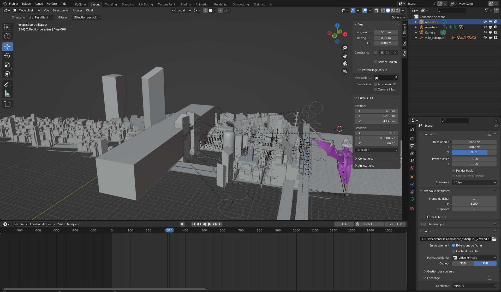
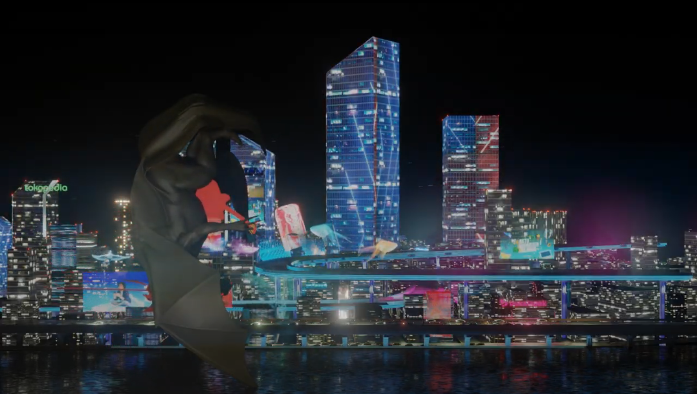
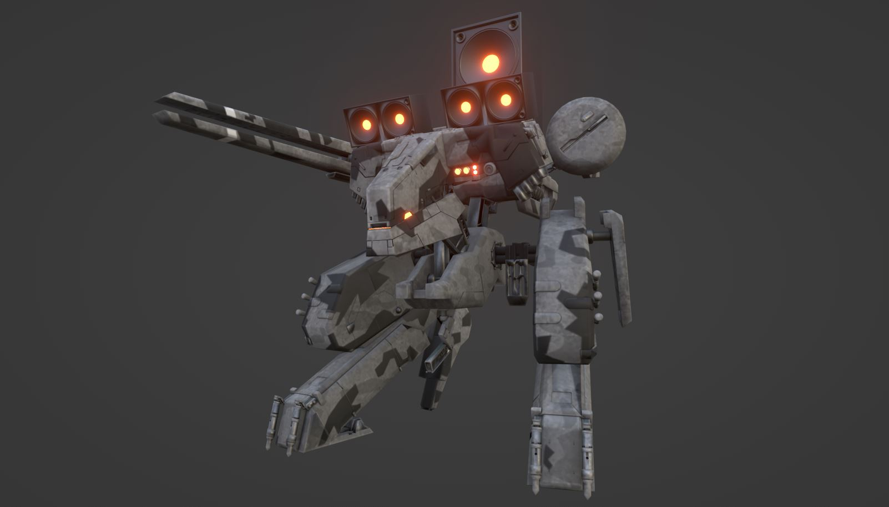
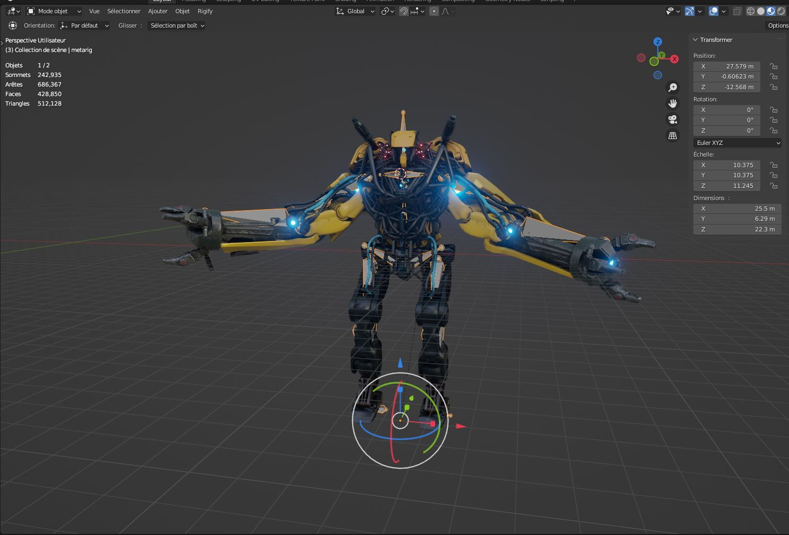
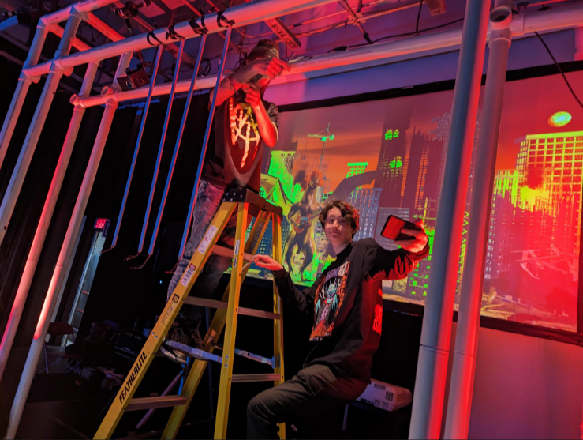
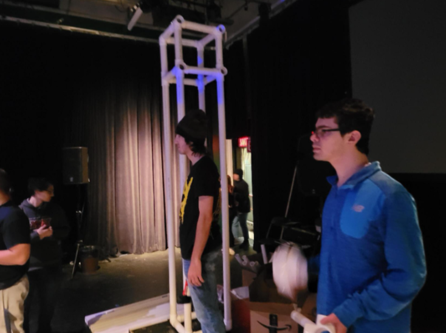
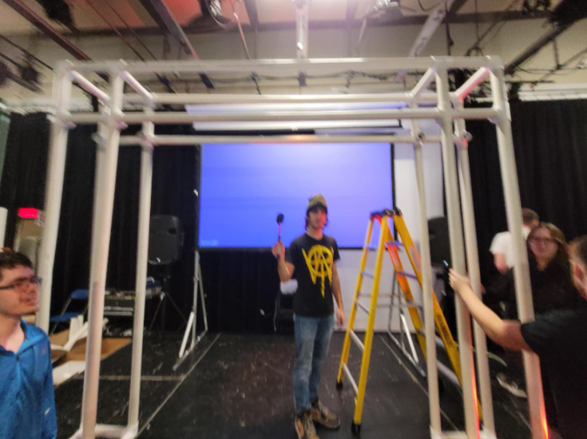

## Résumé

### Mégane :

J'ai passé la semaine à travailler sur la capsule vidéo. J'ai ajouté des transitions, égalisé l'audio et ajouté un mini générique à la fin pour mentionner que la musique a été faite par Kevin et Justin. Lorsque j'ai fini la vidéo, je l'ai postée sur Facebook et Instagram pour que nos publications de la semaine 13 soient déjà faites.

### Charles :

J'ai passé la semaine à travailler sur l'intégration de la musique dans Unity, j'ai intégré le personnage dans les trois scènes du projet, j'ai enfin réparé un bug avec les boutons qui ne marchaient pas, et finalement j'ai réparé quelques bugs de musiques et de synchronisation avec les notes.

### Évan :

J'ai passé la semaine à optimiser le décor 3 (avec de nouvelles modifications et ajouts) et à essayer de l'exporter sur Unity.

Voici une image du rendu (le dragon fait un backflip) :

### Kevin :

Cette semaine, j'ai continué d'animer le décor de la scène 1.

### Xavier :

Début du nouveau personnage de type mecha. J'ai utilisé un asset en ligne où j'ai modifié les couleurs et supprimé/décimé le nombre de vertices. J'ai eu beaucoup de difficultés avec la conception du squelette. Finalement, je vais abandonner ce modèle, car il a une erreur majeure du mesh qui rend le rig impossible.

Après plusieurs tentatives, j'ai finalement choisi un personnage avec des traits humains. C'est toujours un robot ! J'ai encore utilisé un asset, car je n'ai pas le temps de bâtir un personnage de zéro.

## Bons coups et réussites

## Difficultés et défis

### Évan :

J'ai passé des heures à essayer d'exporter le décor 3 en fbx vers Unity. Sans réussite. On a finalement décidé que le décor allait être un rendu Blender intégré dans la scène. (Voici le décor en train de crash)

### Justin :

Après avoir fait avec les autres membres la générale, on s'est rendu compte que l'installation était plus dure que prévu. Aussi, cette expérience nous a permis de remarquer plusieurs problèmes. En effet, la deuxième guitare n'avait plus de pile, donc on était obligé de passer l'autre guitare entre chaque manche du jeu. Aussi, les utilisateurs nous ont fait remarquer que c'était dommage que le décor était derrière eux (ils ne pouvaient donc pas le voir et il n'y avait pas d'animations en lien avec le rythme de la musique). De plus, le son sortait mal (beaucoup de statique) des haut-parleurs que nous avions réservés, il aurait fallu faire des tests avec ceux-ci avant la générale. Bref, on a une meilleure idée de ce qui nous reste à faire et à corriger en vue de ChaosMédia.

### Xavier :

Le rig du premier personnage était déficient. Les méthodes pour régler le problème ne fonctionnaient pas.

## Tâches effectuées

- Ajout de transitions dans la capsule vidéo
- Égalisation de l'audio et finitions de la capsule vidéo
- Ajout d'un générique à la fin de la capsule vidéo
- Publications sur Facebook et Instagram pour la semaine 13
- Optimisation, montage et rendu temporaire du décor 3
- Générale du projet (avec les tests QA)
- Intégration finale de la musique 1, 2 et 3
- Intégration des personnages dans les scènes
- Réparation du bug de notes qui ne marchaient pas
- Recherche d'un nouveau personnage 2
- Création du personnage 2 + rig
