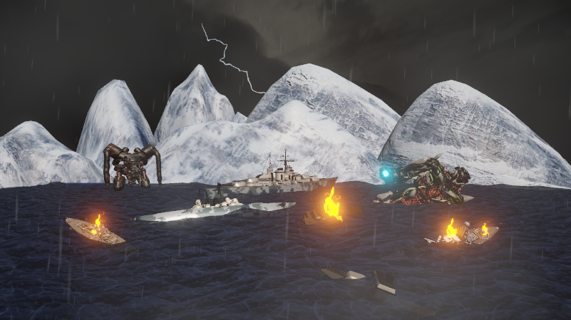

## Résumé

### Mégane :

J'ai débuté la semaine en compilant les capsules vidéos en une seule vidéo. Par la suite, j'ai fait énormément de recherches et de tests pour faire une animation en background cool pour l'écran d'attente de notre jeu. J'ai passée beaucoup de temps sur les tests parce que la plupart des résultats que j'obtenais ne donnait pas l'impression d'un écran d'attente ou ne s'agençait pas avec la direction artistique du projet. Le résultat final a été créer grâce à TouchDesigner (pour le background animé), AfterEffects (pour l'animation de logo), et PremierePro (pour faire une boucle). 
J'ai également pris soin de faire des publications sur Facebook et Instagram. Aussi, j'ai aidé mes collègues avec quelques petites tâches comme la gestion des cables pour les LEDs.

### Justin :

J'ai améliorer l'agencement des objets dans le décor 2. Les montagnes m'agassaient, j'ai donc trouvé un asset qui rend bien meilleur au rendu. J'ai aussi trouvé un asset de bateaux de guerre pour ajouter plus d'épaves dans le décor. Voici à quoi ça ressemble :

## Bons coups et réussites

### Mégane :

J'ai appris comment faire en sorte que ma vidéo boucle dans Premiere Pro.

## Difficultés et défis

### Mégane :

Essayer de faire une animation avec les couleurs de notre projet tout en gardant la lisibilité (et faire en sorte que ça reste accessible) était un défi pour moi. Je me suis donc assurée d'obtenir l'avis de mes collègues pour savoir si le résultat était assez lisible pour eux.

## Tâches effectuées

- Compilation des capsules vidéos en une seule vidéo pour la remise
- Publications sur Facebook et Instagram
- Gestion des cables pour les LEDs
- Recherches et tests pour animation d'un écran d'attente
- Faire en sorte que l'animation d'écran d'attente joue en boucle
- Finission de l'écran d'attente
