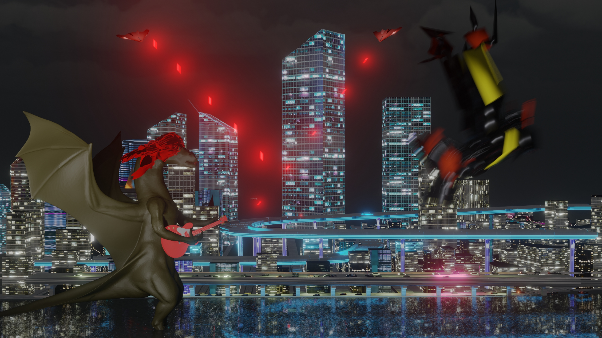

## Résumé

### Mégane :

J'ai débuté la semaine en compilant les capsules vidéo en une seule vidéo. Par la suite, j'ai fait énormément de recherches et de tests pour faire une animation en background cool pour l'écran d'attente de notre jeu. J'ai passé beaucoup de temps sur les tests, parce que la plupart des résultats que j'obtenais ne donnaient pas l'impression d'un écran d'attente ou ne s'agençaient pas avec la direction artistique du projet. Le résultat final a été créé grâce à TouchDesigner (pour le background animé), After Effects (pour l'animation de logo) et Premiere Pro (pour faire une boucle). J'ai également pris soin de faire des publications sur Facebook et Instagram. Aussi, j'ai aidé mes collègues avec quelques petites tâches comme la gestion des câbles pour les LED.

### Justin :

J'ai amélioré l'agencement des objets dans le décor 2. Les montagnes m'agaçaient, j'ai donc trouvé un asset qui rend bien meilleur au rendu. J'ai aussi trouvé un asset de bateaux de guerre pour ajouter plus d'épaves dans le décor. Voici à quoi ça ressemble :

### Évan :

J'ai finalisé le décor 3 en ajoutant des animations (vaisseaux) et j'ai encore fait de petites optimisations. J'ai ajouté des effets (lasers et explosions), ajouté les personnages et arrangé leurs animations pour le décor et fait le rendu final du décor.

Image de l'effet de laser qui a été ajouté aux vaisseaux :

Image du rendu final :

### Kevin :

Durant la semaine 14, je me suis mis à travailler sur la musique de l'écran d'attente. Pour y arriver, j'ai composé des riffs à la basse que j'ai par la suite enregistré et j'ai programmé les percussions de la musique avec le drum track de Ableton. J'ai aussi fait la soudure d'une LED afin de pouvoir remplacer l'une de nos LED qui était partiellement brisée lors de la générale.

### Xavier:

J'ai essayé de réparer des bugs. J'ai réussi à régler la majeure partie des bugs du dragon. J'ai créé le perso 2 avec des animations. Le personnage est un asset et les animations viennent de Mixamo.

## Bons coups et réussites

### Mégane :

J'ai appris comment faire en sorte que ma vidéo joue en boucle dans Premiere Pro.

### Kevin :

J'ai appris que je pouvais programmer les percussions dans une timeline à la place de lancer le recording et de devoir jouer au tempo de la musique avec les touches de mon clavier.

## Difficultés et défis

### Mégane :

J'ai essayé de faire une animation avec les couleurs de notre projet tout en gardant la lisibilité (et faire en sorte que ça reste accessible), c'était un défi pour moi. Je me suis donc assurée d'obtenir l'avis de mes collègues pour savoir si le résultat était assez lisible pour eux ou non.

### Évan :

Je n'ai pas réussi à allonger les animations des personnages. De plus, je n'ai pas réussi à arranger le bug d'animation du perso 2 (mecha) qui le faisait avancer et tourner tout seul dans le décor.

### Kevin :

J'ai eu de la difficulté à être sur le bon tempo avec les drums et la basse. Lors de mon premier essai avec la soudure, j'ai fait fondre le cuivre à l'intérieur de la LED, empêchant celle-ci de fonctionner. À cause de cela, j'ai dû découper un autre morceau de LED que j'ai soudé au morceau qu'on avait déjà. De plus, je me suis brulé 3 fois, parce que je suis maladroit à ce point.

### Xavier:

Bug des animations du dragon dû au transform et à la localisation des frames.

## Tâches effectuées

- Compilation des capsules vidéo en une seule vidéo pour la remise
- Publications sur Facebook et Instagram
- Gestion des câbles pour les LED
- Recherches et tests pour l'animation d'un écran d'attente
- Faire en sorte que l'animation de l'écran d'attente joue en boucle
- Finitions de l'écran d'attente
- Ajout d'animations et d'effets au décor 3
- Rendu final du décor 3
- Musique de l'écran d'attente
- Soudure d'une LED
- Mecha et ses animations
- Fix dragon
