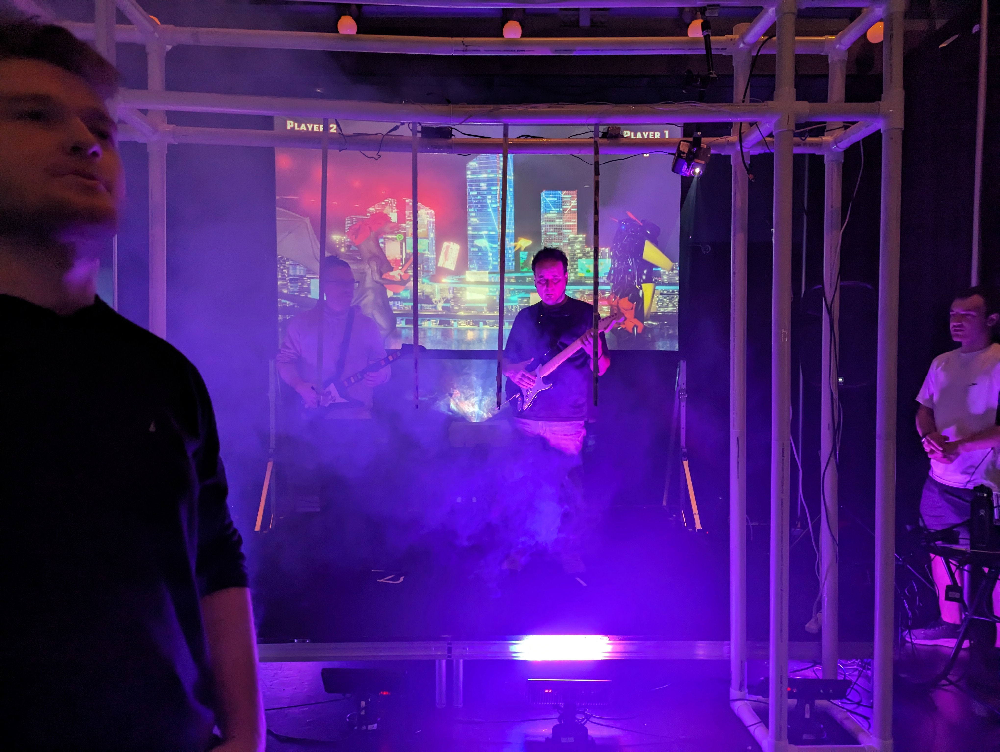

## Résumé

### Mégane :

Cette semaine, c'était ChaosMédia. Je suis arrivée à l'école vers 7h45 et je suis partie vers 11h45 du soir. J'ai aidé à démonter le PVC, fait la gestion des câbles, fait plusieurs tests pour trouver comment on allait installer notre affiche imprimée, accueillit/fait jouer plusieurs invités et fait quelques aller-retour au bureau des profs pour de l'équipement. Je suis restée avec Kevin, Xavier et Évan le soir pour faire l'inventaire de l'équipement. Kevin et moi sommes restés un peu après pour aller chercher le kit de soudure et pour aider à bien rouler le filage. J'ai aussi ramassé tous les déchets que je trouvais sur le sol.

### Justin :

Pour la journée de ChaosMédia, je suis arrivé vraiment tôt (7h40). J'ai aidé à l'assemblage de la scène (PVC) ainsi que le filage (j'avais apporté 3 rallonges pour cela). J'ai joué avec des invités et j'ai animé le jeu pour ceux qui y jouaient. Je suis resté assez tard pour aider au démontage de la scène et pour rapporter le matériel au bureau des profs.

### Xavier:

Je suis arrivé au Cégep à 8h. J'avais préparé mes outils en cas de besoin si trop d'équipes utilisaient ceux des profs. J'ai trouvé la journée un peu longue, surtout pour les pieds, on est resté debout durant presque toute la journée. Sinon, j'ai apprécié la journée. Lorsque je suis parti avec Évan, il était 11h20. La remise des matériaux utilisés a été un peu chaotique, mais je pense que l'entièreté de la journée pourrait être definie comme telle.

### Évan :

Après avoir passé 9 heurs dans la salle de spectacles, j'étais déjà un peu fatigué quand les invités sont arrivés à 17h. J'éai quand même survécus à la journée. C'tait amusant de voir la version finale des différents projets de nos collègues, bien que chacun ait eu leurs problèmes.

### Kevin :

Cette semaine a eu lieu ChaosMédia. Lors de l'installation du projet, je me suis surtout occupé de l'aspect physique. C'est à dire le montage de la structure en PVC et l'installation des leds et du petit projecteur. Durant l'événement, j'ai a de multiple reprise supervisé l'installation et j'ai aidé l'équipe de Mission presque impossible vers la fin de l'évènement, car ils manquaient d'éffectif. Après la remise des pixels d'or, J'ai contribué comme le reste de mon équipe au démontage du projet. Je suis rester un peu plus tard que les autres avec Mégane pour finaliser le listage du matériel. Je dois aussi redonner à la disti de l'équipements qu'on avait loué sous le nom d'Évan ce jeudi. 

## Bons coups et réussites

### Mégane :

On a réussi à faire une meilleure gestion des câbles que je pensais. Je pensais que le tape transparent serait trop apparent et que ça serait pas très beau, mais c'était beaucoup plus présentable qu'à la générale.

### Justin :

On a réussi à assembler notre matériel plus rapidement que lors de la générale. Cette fois, on savait ce qu'on faisait !

### Kevin :

Je suis fier de notre installation. Je trouve qu'on a réussi à présenter quelque chose d'amusant. J'ai été surpris d'avoir reçu autant de compliment au sujet du projet. Personnellement, je n'ai entendu que du positif sur notre projet.

## Difficultés et défis

### Mégane :

On pensait que notre jeu ne fonctionnait pas du tout quelques minutes avant l'évaluation. En effet, lorsqu'on pesait sur le bouton play et chargeait une scène, la musique et les notes ne jouaient pas. Finalement, Charles nous a écrit après son évaluation pour nous dire qu'il fallait simplement peser sur "enter". Tout était réglé !

### Justin :

On a eu de la difficulté à taper les fils sur le PVC, car le tape était difficile à décoller du rouleau (on a donc pris un autre). Aussi, on a dû attendre assez longtemps pour pouvoir percer le PVC afin de visser nos bandes à LED. En effet, on avait besoin d'une perceuse pour le faire et la seule équipe qui en avait une en avait besoin pour assez longtemps (on leur a emprunté pour une courte période de temps (on avait seulement 4 trous à faire)). Puisque les vis des supports à LED étaient vraiment petites, on n'avait pas pu les fixer au PVC avec une perceuse. Xavier avait pris l'initiative d'apporter son sac à outils et on a pu le faire avec un tournevis.

### Xavier:

Gestion de temps difficile dû à mon examen en littérature qui a bien fini (un gros stress supplémentaire).

### Évan : 

Le soir, j'ai eu moins de motivation et la fatigue s'accumulait. J'avais envie de dormir sur la scène des fois. Sinon durant le montage, on a eu des problème pour lancer le jeu, mais cela a été réglé en cliquant sur un seul bouton.

### Kevin : 

En générale ça c'est passé beaucoup mieux que ce que j'avais imaginé. On a juste eu un peu peur 1 heure avant l'évaluation, car Charles était parti à son cours et on croyait que le projet ce lançait de la même manière qu'à la générale, donc on arrivait pas à lancer nos musique. Au final, Charles nous à envoyer un message sur Teams et il suffisait seulement d'appuyer sur enter...

## Tâches effectuées

- Monter et démonter le PVC
- Gestion des câbles
- Installation de l'affiche imprimée
- Accueil de plusieurs invités afin qu'ils puissent tester notre installation
- Inventaire de l'équipement
- Ménage à la fin (ramasser tous les déchets sur le sol)
