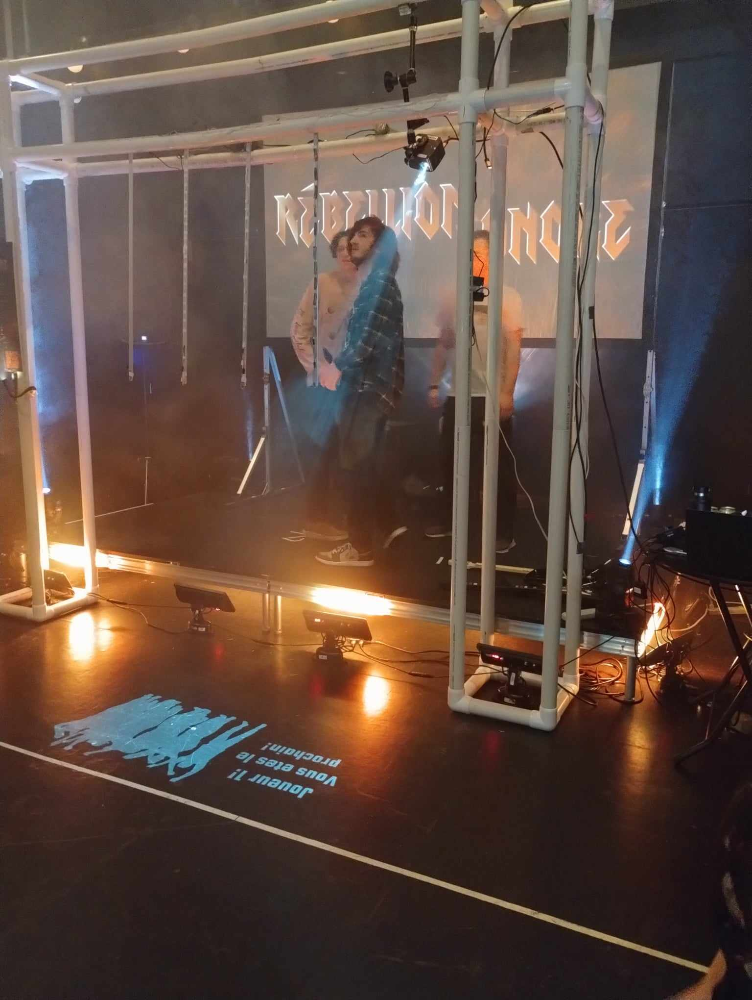

## Résumé

### Mégane :

Cette semaine, c'était ChaosMédia. Je suis arrivée à l'école vers 7h45, et je suis partie vers 11h45 du soir. J'ai aidé à démonter le pvc, faire la gestion des câbles, fait plusieurs tests pour trouver comment on allait installer notre affiche imprimée, accueillit/faire jouer plusieurs invités, et fait quelques aller-retour au bureau des profs pour de l'équipement. Je suis resté avec Kevin Xavier et Évan le soir pour faire l'inventaire de l'équipement. Moi et Kevin somme resté un peu après pour qu'il aie chercher le kit de soudure et que j'aide à bien rouler le filage. J'ai aussi ramasser tout les déchets que je trouvais sur le sol.

## Bons coups et réussites

### Mégane :

On a réussit a faire une meilleure gestion des câbles que je pensais. Je pensais que le tape transparent serait trop apparant et que ça serait pas très beau, mais c'était beaucoup plus présentable qu'à la générale.

## Difficultés et défis

### Mégane :

On pensait que notre jeu ne fonctionnait pas du tout quelques minutes avant l'évaluation; lorsqu'on pesait sur le bouton play et chargait une scène, la musique et les notes ne jouaient pas. Finalement, Charles nous a écrit pendant qu'il était en évaluation pour nous dire qu'il fallait simplement peser sur ''enter''. Tout était régler !

## Tâches effectuées

- Démonter le pvc
- Monter le pvc
- Gestion de câbles
- Installation de l'affiche imprimée
- Accueil de plusieurs invités afin qu'ils puissent tester notre installation
- Inventaire de l'équipement
- Ménage à la fin (ramasser tout les déchets sur le sol)
