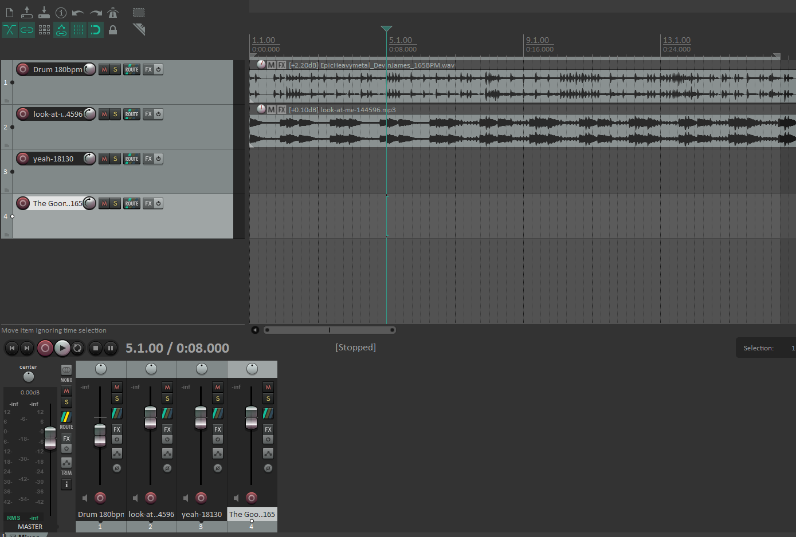

## Résumé

### Mégane:

J'ai fait une nouvelle version du logo pour les réseaux sociaux, et j'ai fait une image de cover pour Facebook.

### Justin:

Kevin et moi avons commencé à faire des recherches sur les différents instruments de musique qu'on peut utiliser pour notre musique. On a décidé de commencer par créer une musique pour le moment avant de créer les autres. Voici à quoi ressemble notre début de montage audio dans le logiciel Reaper :

## Bon coups et réussites

## Difficultés et défis

### Justin:

Kevin et moi avons décidé d'utiliser le logiciel Reaper pour le montage audio, car celui-ci offre plus d'options pour l'ajout d'instruments et le niveau audio. Nous avons trouvé l'adaptation à ce nouveau logiciel simple, car il est très similaire à la suite Adobe.

### Mégane:

On a fait un compte Facebook pour faciliter la gestion des réseaux sociaux, mais il s'est fait désactivé et nous n'avions plus accès à la page Facebook que nous avions créée.

## Tâches effectuées

- Création et configuration des réseaux sociaux
- Création d'un logo et d'une photo de couverture pour les réseaux sociaux
- Début de la création d'une musique
