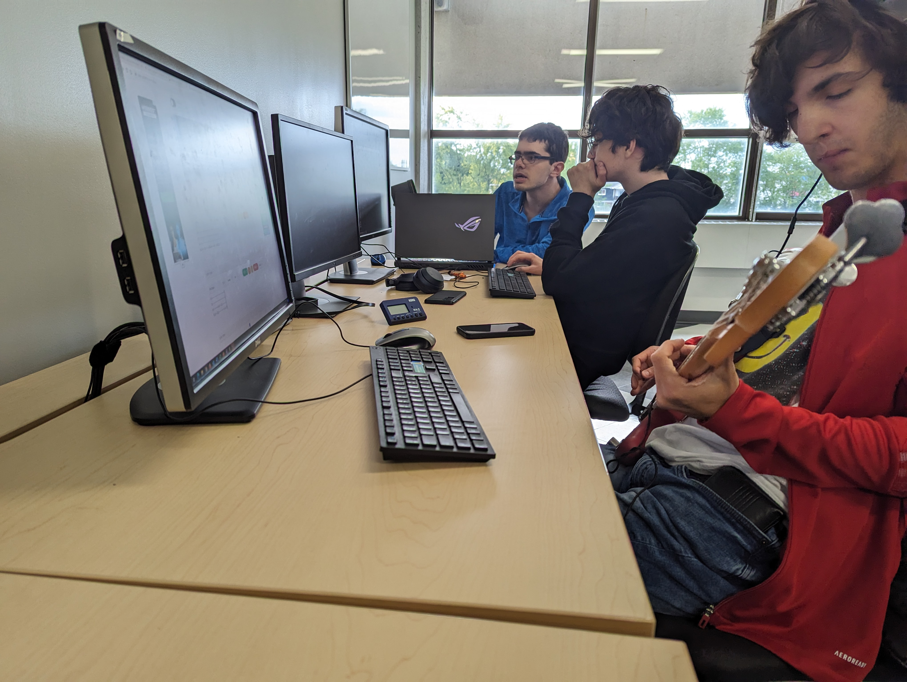
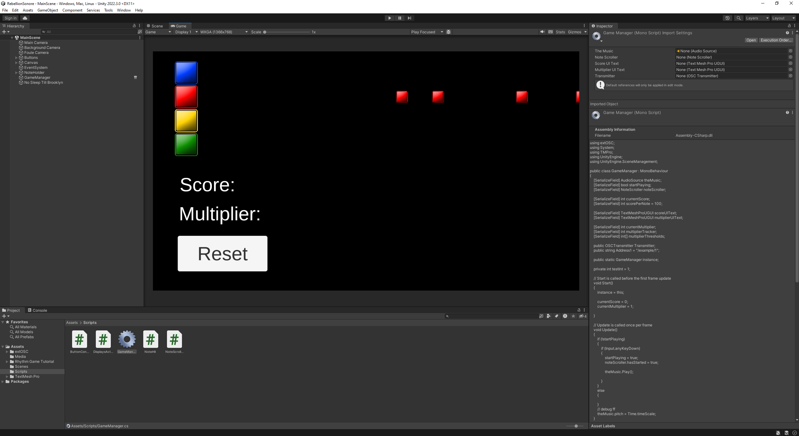

## Résumé

### Mégane:

J'ai fait une nouvelle version du logo pour les réseaux sociaux, j'ai fait une image de fond pour Facebook, et j'ai fait une publication sur Facebook. Évan et moi avons fait les comptes du projet sur les réseaux sociaux.
J'ai recréé la page Facebook sur mon compte personnel, puisque le compte Facebook que nous avions créé a été désactivé.

### Justin:

Kevin et moi avons commencé à faire des recherches sur les différents instruments de musique qu'on peut utiliser pour notre musique. On a décidé de commencer par créer une musique pour le moment avant de créer les autres. Voici à quoi ressemble notre début de montage audio dans le logiciel Reaper :

### Xavier:

J'ai trouvé des parties de mes modèles en prefabs telles que la guitare et le corps du personnage de type dragon. J'ai décidé de débuter la modélisation par sa tête.

### Évan:

J'ai réorganisé le Trello et les tâches effectuées par l'équipe. J'ai aussi refait le budget en ayant une meilleure vision des équipements qui nous seraient disponibles pour le projet. Mégane et moi avons fait les comptes du projet sur les réseaux sociaux.

### Kevin:

Durant cette semaine, j'ai surtout fait de la recherche afin de pouvoir créer la première musique de notre projet. J'ai exploré Ableton et Reaper pour mieux me familliariser avec leurs interfaces. J'ai trouvé une drum track qui me plait pour, par la suite, composer la bassline en me basant sur cette dernière.

### Charles:

Pendant cette semaine, j'ai fait la plupart de la programmation Unity pour avoir un système de notes et de score, avec une musique en placeholder. J'ai aussi trouvé un moyen de synchroniser les LED avec ce qui arrive sur l'écran sur Unity, pour qu'on puisse faire des effets et du level design plus facilement.

## Bons coups et réussites

### Charles:

J'ai trouvé une façon de convertir le viewport Unity en quelque chose que les LED peuvent afficher, grâce à un logiciel qui prend des parties de mon écran et qui les convertit en signaux qu'il envoie a l'Arduino UNO qui fait allumer les LED. Avec ceci, ce sera plus facile prochainement de faire des effets.

## Difficultés et défis

### Évan:

Il y eut des problèmes avec la création du compte Facebook du projet. La page a fini par être effacée à cause d'un manque d'information concernant le projet.

### Justin:

Kevin et moi avons décidé d'utiliser le logiciel Reaper pour le montage audio, car celui-ci offre plus d'options pour l'ajout d'instruments et le niveau audio. Nous avons trouvé l'adaptation à ce nouveau logiciel simple, car il est très similaire à la suite Adobe.

### Mégane:

On a fait un compte Facebook pour faciliter la gestion des réseaux sociaux, mais il s'est fait désactiver et nous n'avions plus accès à la page Facebook que nous avions créée.

### Xavier:

Trouver des prefabs et sculpter une tête de dragon. C'est difficile d'en trouver une déjà faite, car tous les bons prefabs sont payants. La sculpture de haut niveau est plus dure que prévu.

### Kevin:

J'ai eu de la difficulté à pouvoir enregistrer ma basse correctement. J'utilise un interface audio afin de pouvoir enregistrer ma basse dans Ableton, le problème est que je n'arrivais pas à connecter mes écouteur à cette interface. J'ai trouvé après plusieurs recherches que le problème était que mes écouteurs ont tous des microphones, donc j'ai acheté un adaptateur qui sépare les écouteurs du micro et, finalement, ça a fonctionné. La qualité audio n'est pas super bonne, probablement à cause du voltage des deux appareils. Au moins, je peux savoir ce que je joue.

### Charles:

J'ai eu de la misère avec certains aspects de la programmation, comme le score. J'ai aussi eu quelques problèmes avec Visual Studio qui ne voulait pas bien formater le code pour que je travaille dessus.

## Tâches effectuées

- Création et configuration des réseaux sociaux (et recréation/reconfiguration de la page Facebook)
- Création d'un logo et d'une photo de couverture pour les réseaux sociaux
- Publication sur Facebook
- Début de la création d'une musique
- Début de la création du personnage 1
- Réorganisation du Trello
- Réorganisation du budget
- Début de la création de la base du jeu + prototype
