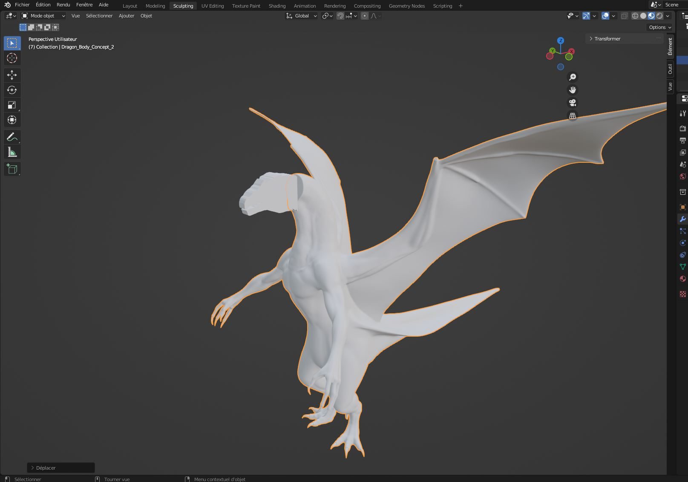

## Résumé

### Mégane:

J'ai fait une nouvelle version du logo pour les réseaux sociaux, et j'ai fait une image de cover pour Facebook.

### Justin:

Kevin et moi avons commencé à faire des recherches sur les différents instruments de musique qu'on peut utiliser pour notre musique. On a décidé de commencer par créer une musique pour le moment avant de créer les autres. Voici à quoi ressemble notre début de montage audio dans le logiciel Reaper :

### Xavier:
J'ai trouvée des parties de mes models en prefab telle que la guitar et le corp du personnage dragon. j'ai debuter la tete du prsonnage de type dragon. 

### Évan: 

J'ai réorganisé le Trello et les tâches effectuées par l'équipe. J'ai aussi refait le budget en ayant une meilleure vision des équipements qui nous seraient disponibles pour le projet. Moi et Mégane avont fait les comptes du projet sur les résaux sociaux.

### Kevin:

Durant cette semaine, j'ai surtout fais de la recherche afin de pouvoir créer la première musique de notre projet. J'ai exploré Ableton et Reaper pour mieux me familliarisé avec leurs interface. J'ai trouvé une drum track qui me plait pour, par la suite, composer la bass line en me basant sur cette dernière.  

## Bon coups et réussites

## Difficultés et défis

### Évan:

Il y eu des problèmes avec la création du compte Facebook du projet. La page a finit par être effacé à cause d'un manque d'information concernant le projet.

### Justin:

Kevin et moi avons décidé d'utiliser le logiciel Reaper pour le montage audio, car celui-ci offre plus d'options pour l'ajout d'instruments et le niveau audio. Nous avons trouvé l'adaptation à ce nouveau logiciel simple, car il est très similaire à la suite Adobe.

### Mégane:

On a fait un compte Facebook pour faciliter la gestion des réseaux sociaux, mais il s'est fait désactivé et nous n'avions plus accès à la page Facebook que nous avions créée.

### Xavier:
Trouvé des prefabs et sculpter une tete de dragon. il est difficile car tout les bon prefabs sont payant. Sculpter de haut niveau est plus dure que prevue.

### Kevin:

J'ai eu de la difficulté à pouvoir enregistrer ma basse correctement. J'utilise un interface audio afin de pouvoir enregistrer ma basse dans Ableton, le problème est que je n'arrivais pas à connecter mes écouteur à cette interface. J'ai trouvé après plusieurs recherches que le problème était que mes écouteurs ont tous des microphones, donc j'ai acheté un adaptateur qui sépare les écouteurs du micro et, finalement, ça a fonctionné. La qualité audio n'est pas super bonne, probablement à cause du voltage des deux appareils. Au moins je peux savoir ce que je joue. 

## Tâches effectuées

- Création et configuration des réseaux sociaux
- Création d'un logo et d'une photo de couverture pour les réseaux sociaux
- Début de la création d'une musique
- debut création personnage 1
- Réorganisation du Trello
- Réorganisation du budget
