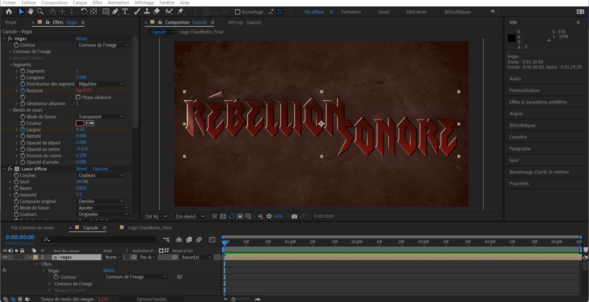
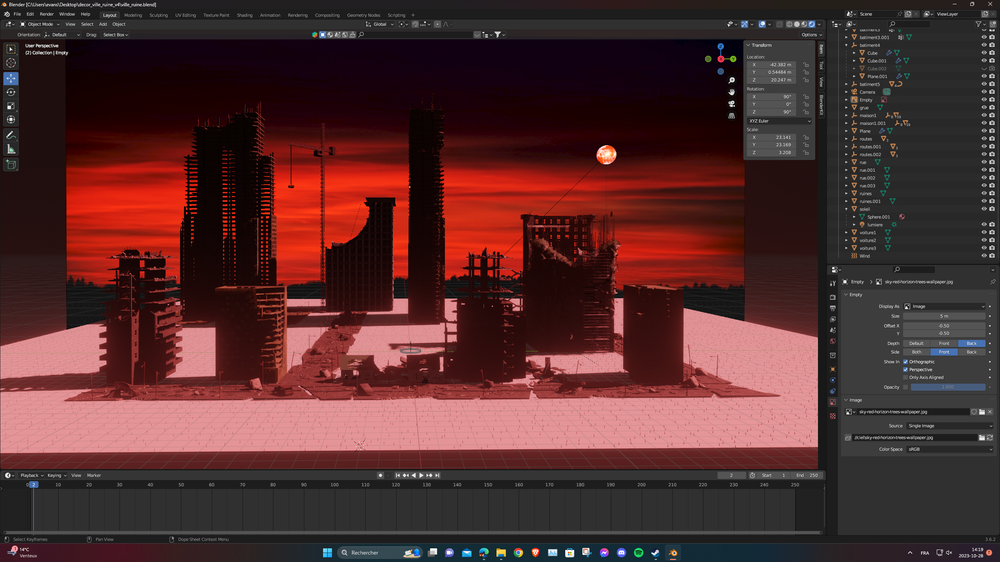

## Résumé

### Mégane:

J'ai travaillé sur le _motion design_ du logo de Rébellion Sonore pour la capsule promotionnelle, et j'ai fait une publication sur Instagram. Évan et moi avons aussi commencé la planification pour la capsule promotionnelle.
J'ai fais des recherches de contenus libre de droits pour la vidéo promotionnelle.

### Évan:

J'ai commencé à créer un décor pour une des animations du jeu sur Blender. Mégane et moi avons aussi commencé la préparation pour la capsule promotionnelle.

## Bons coups et réussites

## Difficultés et défis

### Évan:

J'ai eu un peu de difficulté avec le décor pour trouver le bon éclairage et les bons assets.

## Tâches effectuées

- Création de l'animation du logo de Rébellion Sonore pour la capsule promotionnelle
- Préparation/planification de la capsule promotionnelle
- Recherche de contenus libre de droits pour la capsule promotionnelle
- Recherches d'assets pour le décor 3D et montage d'une partie de la scène Blender
