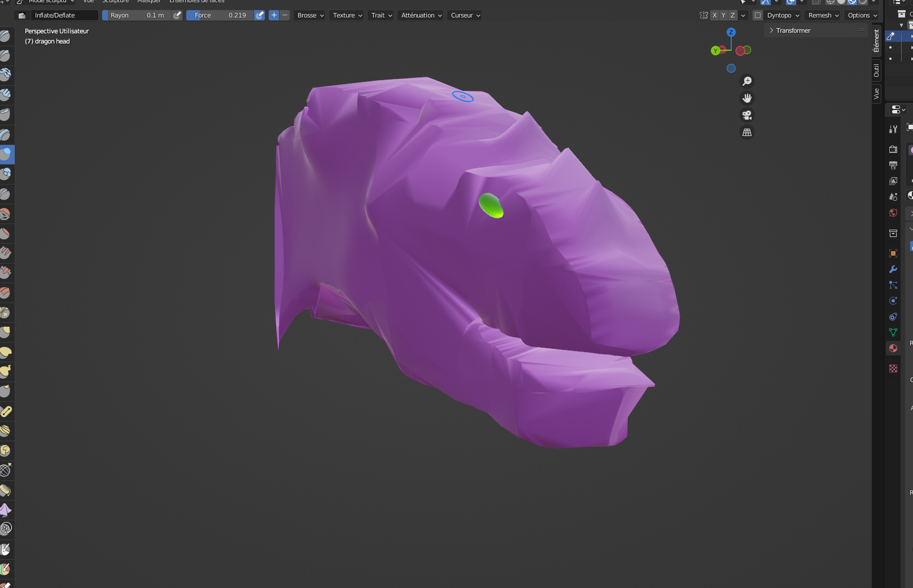
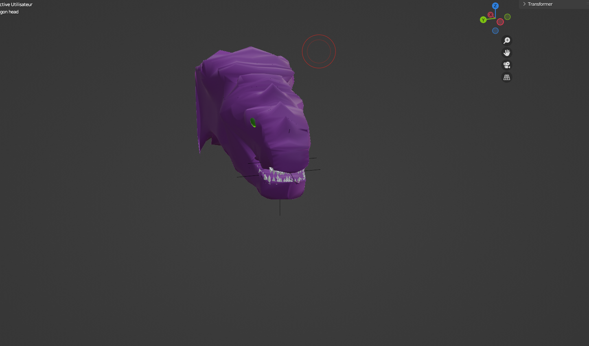
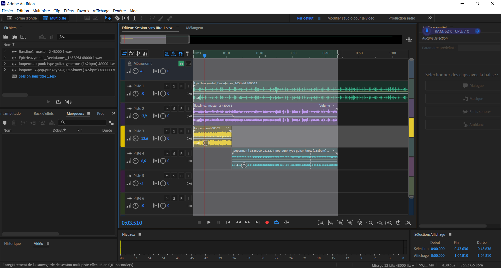

## Résumé

### Mégane:

J'ai travaillé sur le _motion design_ du logo de Rébellion Sonore pour la capsule promotionnelle, et j'ai fait une publication sur Instagram. Évan et moi avons aussi commencé la planification pour la capsule promotionnelle.
J'ai fait des recherches de contenus libres de droits pour la vidéo promotionnelle.
J'ai découpé le fichier audio d'Évan en sections pour faciliter le montage de la vidéo promotionnelle.

### Évan:

J'ai commencé à créer un décor pour une des animations du jeu sur Blender. Mégane et moi avons aussi commencé la préparation pour la capsule promotionnelle.

### Justin:

Kevin et moi avons continué l'avancement de la musique. J'ai réussi à trouver des solos de guitares potables sans drums comme accompagnements. Kevin va essayer de jouer plus aigu avec sa basse pour faire la guitare principale (puisqu'on a pas de guitare électrique et que ma guitare est acoustique).

### Xavier:

J'ai continué le développement de la tête de dragon. Cette semaine, j'ai ajouté des yeux et des dents. J'ai aussi fait le sculptage pour lui donner un meilleur look.

## Bons coups et réussites

## Difficultés et défis

### Évan:

J'ai eu un peu de difficulté avec le décor pour trouver le bon éclairage et les bons assets.

### Xavier:

La manière que j'ai modelé la tête a fait que je ne pouvais pas sculpter dedans. La tête ne pouvait pas avoir de vertice sur les côtés. Après de longues recherches, j'ai trouvé une manière manuelle et plus efficace.
J'ai pu finalement sculpter malgré les difficultés. La manière que j'ai utilisée est le découpage biseau.

### Justin:

Après avoir travaillé dans Reaper, j'ai décidé de changer de logiciel en passant vers Audition, je me sens plus à l'aise avec la suite Adobe (montage sonore).

### Mégane:

J'ai eu de la difficulté à commencer le montage de la capsule vidéo, car j'attendais d'avoir tout le contenu visuel nécessaire pour débuter le montage, mais j'ai fini par changer d'avis lorsque je me suis rendu compte que je perdais trop de temps à attendre.
J'ai également eu de la difficulté à travaillé sur le montage à l'école, puisque j'ai commencé le travail chez moi sur une version différente d'After Effects que ceux qui sont sur les ordis de l'école.

## Tâches effectuées

- Création de l'animation du logo de Rébellion Sonore pour la capsule promotionnelle
- Préparation/planification de la capsule promotionnelle
- Recherche de contenus libre de droits pour la capsule promotionnelle
- Découpage/préparation des fichiers audios pour la capsule promotionnelle
- Recherches d'assets pour le décor 3D et montage d'une partie de la scène Blender
- Avancement de la tête du personnage 1 qui est un dragon
